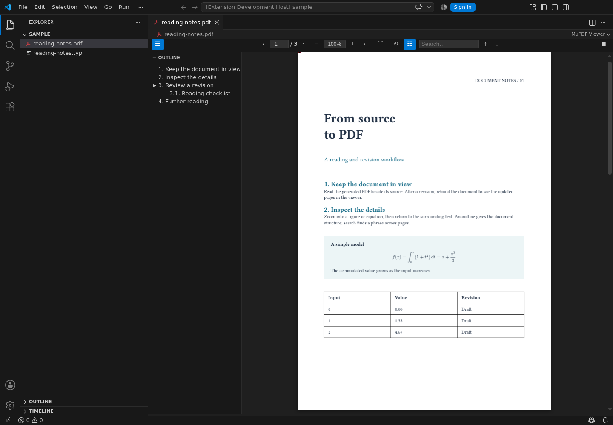
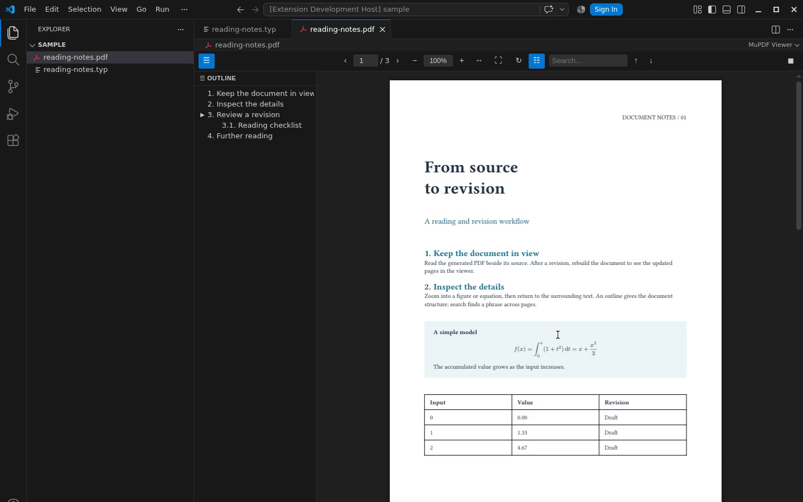
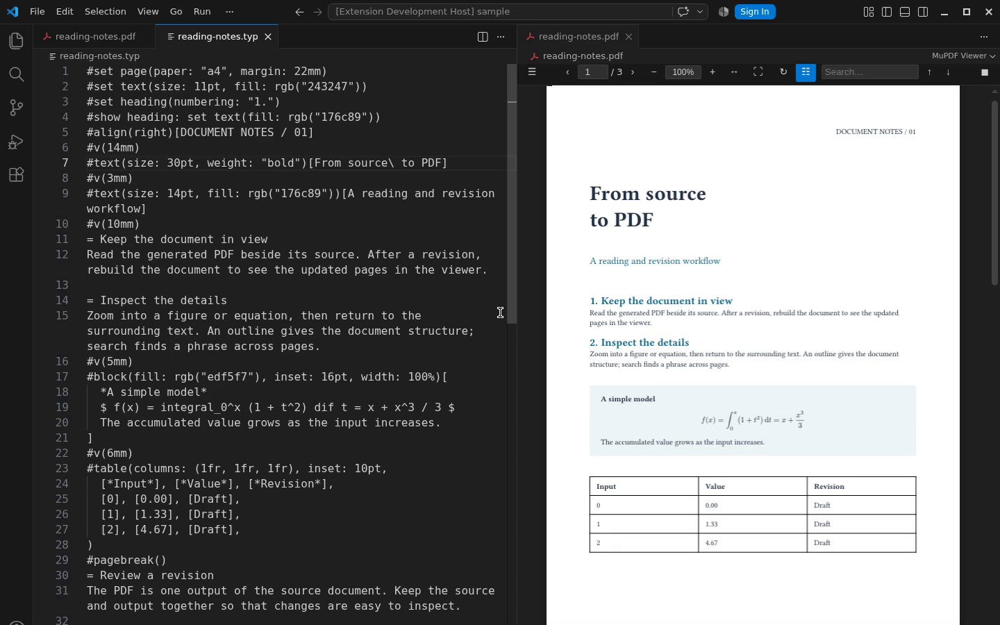
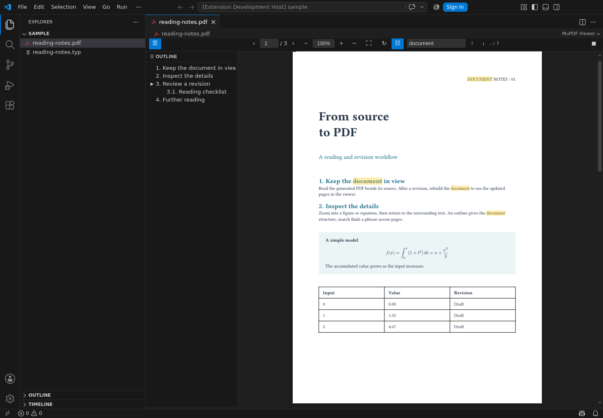

# MuPDF Viewer

[English](README.md) | 日本語

[](https://marketplace.visualstudio.com/items?itemName=skrtk98.mupdf-viewer)
[](https://open-vsx.org/extension/skrtk98/mupdf-viewer)

マウス位置を基点としたズームと、ファイル更新時の自動再読み込みで、VS Code 内で PDF を読めます。
WebAssembly にコンパイルした [MuPDF](https://github.com/ArtifexSoftware/mupdf) を描画エンジンに採用し、VS Code 向けの閲覧 UI を備えています。



## MuPDF Viewer を選ぶ理由

生成した PDF をソースファイルの隣に開いて、作業中に確認できます。
LaTeX や Typst などで文書を再ビルドすると、ディスク上の PDF の更新に応じて表示が再読み込みされます。
ビルドには普段のツールを使い、MuPDF Viewer で閲覧とページ移動を行えます。

## 主な機能

- **MuPDF/WASM による描画**：VS Code のカスタムエディタで PDF を表示。
- **マウス位置を基点としたズーム**：`Ctrl+ホイール` または `マウス右ボタン+ホイール` で拡大縮小。
- **2 つの表示モード**：連続スクロールと単ページ表示を切り替え。
- **自動再読み込み**：開いている PDF がディスク上で変更されると表示を更新。
- **ナビゲーション**：アウトライン、サムネイル、ページ番号、PDF 内の内部リンクと外部リンクに対応。
- **検索とテキスト選択**：文書全体の検索、テキストの選択とコピー。
- **画像コピーと回転**：画像を PNG としてコピーし、ページ単位で回転。

## デモ

右ボタンを押しながらホイールを回すと、数式の上に置いたマウス位置を基点にズームできます。



Typst ソースを編集して再ビルドすると、隣に開いた PDF の表示が自動更新されます。



アウトラインを表示しながら文書全体を検索できます。



## 使い方

VS Code で任意の `.pdf` ファイルを開くと、カスタムエディタとして自動的にビューワーが起動します。
ファイルがディスク上で変更された場合も自動的に再読み込みされます。

### 表示モード

ツールバーの **スクロール/単ページ** 切り替えボタンで以下のモードを切り替えられます。

- **スクロールモード**（デフォルト）：全ページを連続表示
- **単ページモード**：1 ページずつ表示

### ズーム

| 操作 | 動作 |
|------|------|
| `Ctrl+ホイール` | マウス位置を基点にズームイン/アウト |
| `マウス右ボタン+ホイール` | マウス位置を基点にズームイン/アウト |
| `+` / `=` | ズームイン |
| `-` | ズームアウト |
| 幅に合わせるボタン | コンテナ幅に合わせてスケール |
| ページに合わせるボタン | ページ全体が収まるようにスケール |
| ズーム入力欄 | パーセント（例: `150%`）または小数（例: `1.5`）で入力 |

### ナビゲーション

| 操作 | 動作 |
|------|------|
| `PageDown` / `ArrowRight` | 次のページ |
| `PageUp` / `ArrowLeft` | 前のページ |
| ページ番号入力欄 | 指定ページへジャンプ |
| アウトラインサイドバーの項目 | ブックマークページへジャンプ |
| サムネイル | 対応するページへジャンプ |
| リンクをクリック | リンク先のページへジャンプ、または外部URLをブラウザで開く |

### テキスト選択とコピー

- **クリックしてドラッグ** でテキストを選択。
- **ダブルクリック** で単語を選択。
- **Ctrl+C** で選択テキストをクリップボードにコピー。

### 検索

検索ボックスに入力するとドキュメント全体からテキストを検索します。
**Enter** / **Shift+Enter** または矢印ボタンでヒット間を移動できます。

### コンテキストメニュー

画像を右クリックすると PNG としてコピーできます。

### 回転

回転ボタンをクリックすると現在のページを 90° 時計回りに回転します。

## 設定

| キー | 型 | デフォルト | 説明 |
|------|----|-----------|------|
| `pdfViewer.defaultZoom` | number | `1.0` | 初期ズーム倍率（1.0 = 100%）。 |
| `pdfViewer.renderResolution` | number | `96` | レンダリング解像度（DPI）。高いほど高品質だがメモリ使用量が増加する。 |

## MuPDF の採用について

MuPDF Viewer は、WebAssembly にコンパイルした MuPDF を描画エンジンとして使っています。
ツールバー、ナビゲーション、ズーム操作は拡張機能側で実装し、VS Code 内での日常的な PDF 閲覧に用途を絞っています。

## インストール

[Visual Studio Marketplace](https://marketplace.visualstudio.com/items?itemName=skrtk98.mupdf-viewer) で **skrtk98** の **MuPDF Viewer** をインストールするか、次のコマンドを実行します。

```sh
code --install-extension skrtk98.mupdf-viewer
```

Open VSX を利用する環境では、[Open VSX Registry](https://open-vsx.org/extension/skrtk98/mupdf-viewer) からインストールできます。

PDF を開くと閲覧を開始できます。
別の拡張機能で開く場合は、エディタのタブを右クリックし、**エディターを開くアプリケーションの選択…**（Reopen Editor With…）から **MuPDF Viewer** を選択します。

## 開発とリリース

ローカルでの検証、VSIX の作成、Visual Studio Marketplace と Open VSX への公開については、[リリース手順](docs/releasing.md)を参照してください。

## ライセンス

[AGPL-3.0](LICENSE) で提供しています。
